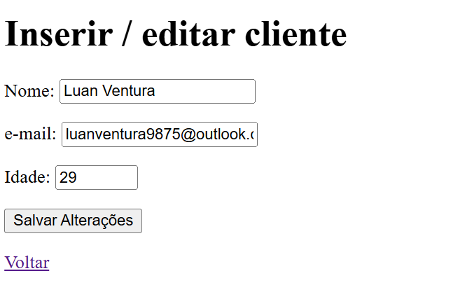
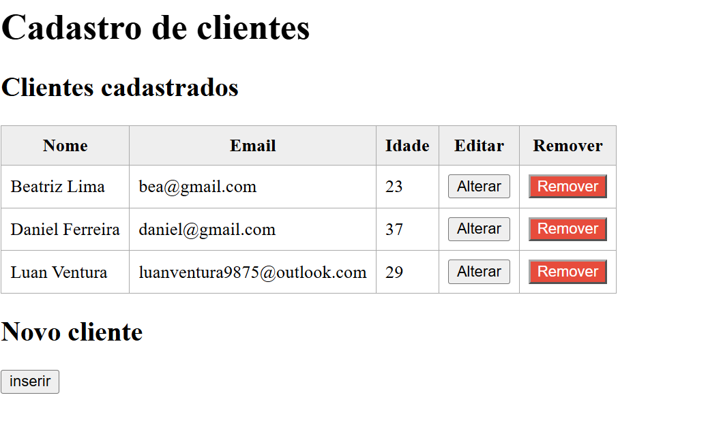

# Simple Web-Based Client Registry

A simple client registration web application built with Spring Boot, Spring MVC, Spring Data JPA, Thymeleaf, and an H2 database.

This project allows you to register, list, edit, and remove client records through a web interface, with validation for name, email, and age.

## Overview

This project is a lightweight CRUD example built with the Spring ecosystem. It demonstrates how to create a full-stack Java web application using:

- Spring Boot
- Spring MVC
- Spring Data JPA
- Thymeleaf
- H2 Database

## Features

- Register new clients
- View all saved clients
- Edit existing client information
- Remove clients from the registry
- Validate required form fields
- Persist data using JPA
- Access the H2 database console locally

## Screenshots

### Main list page



### Edit client form



## Tech Stack

- Java 17
- Spring Boot 3.x
- Spring Web MVC
- Spring Data JPA
- Thymeleaf
- Hibernate
- H2 Database

## Requirements

Before running the project, make sure you have:

- Java 17+
- Maven

## Getting Started

### Run the application

From the project root, run:

```bash
./mvnw spring-boot:run
```

On Windows:

```bash
mvnw.cmd spring-boot:run
```

Then open the app in your browser:

```text
http://localhost:8080/
```

### H2 Database Console

The H2 console is enabled and can be accessed at:

```text
http://localhost:8080/h2-console
```

Use the following connection settings:

```text
JDBC URL: jdbc:h2:file:./data/clientes-db
Username: sa
Password: (empty)
```

## Application Routes

- `/` — List all clients
- `/novo/` — Open the form to create a new client
- `/salvar` — Save a client
- `/editar/{id}` — Edit a specific client
- `/remover/{id}` — Delete a client

## Project Structure

```text
src/
├── main/
│   ├── java/
│   │   └── com/minhaempresa/cadastroclientes/
│   │       ├── controller/
│   │       ├── model/
│   │       ├── repository/
│   │       └── service/
│   └── resources/
│       ├── application.properties
│       ├── static/
│       └── templates/
├── test/
│   └── java/
└── docs/
    └── screenshots/
```

## Domain Model

The `Cliente` entity contains:

- `id`
- `nome`
- `email`
- `idade`

These fields are validated using Java Bean Validation annotations.

## Notes

This is a simple learning project and a good example of how to build a CRUD web application with Java and Spring. It can be expanded with features like filtering, pagination, REST APIs, authentication, or a modern frontend.
